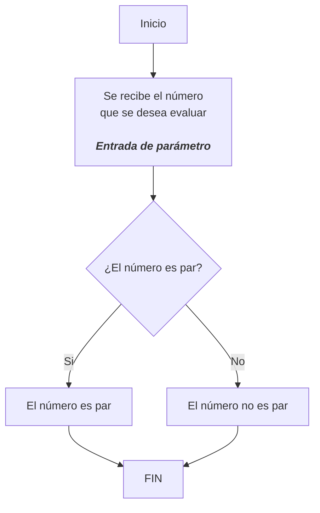

# Validar si un número es par o impar
### Inicia el programa
1. Recibe numero a validar
2. Verifica si el número es par.
3. Mostrar el resultado.
### Fin

```mermaid
flowchart TD
A[Inicio] --> B[Se recibe el número <br> que se desea evaluar
                <br><i><strong>Entrada de parámetro]
B -->  C{¿El número es par?}
C --> |Si| D[El número es par]
C --> |No| E[El número no es par]
D --> Z[FIN]
E --> Z

```
