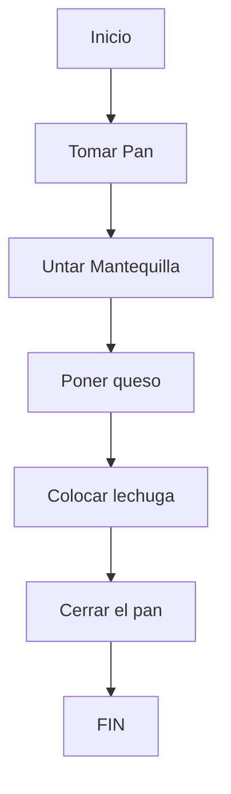

 # Hacer Sándwich
 1. Tomar pan.
 2. Untar mantequilla.
 3. Poner queso.
 4. Colocar lechuga.
 5. Cerrar el pan.

```mermaid
flowchart TD
A[Inicio] --> B[Tomar Pan]
B --> C[Untar Mantequilla]
C --> D[Poner queso]
D --> E[Colocar lechuga]
E --> F[Cerrar el pan]
F --> Z[FIN]

```